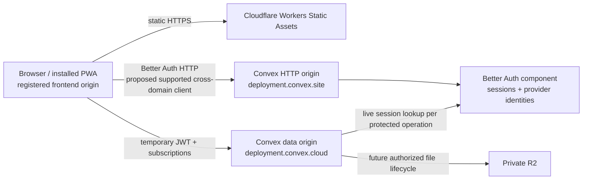

# ADR 0001 — Runtime and auth compatibility

Date: 2026-09-09. Status: **proposed; independent P0 review required**. Local service compatibility is demonstrated; production/browser transport adoption remains unresolved. This document does not approve protected-core changes or advance P1.

## Runtime and exact candidates

| Package | P0 pin/candidate | Evidence |
|---|---|---|
| Node | 24.18.0 | Workspace engine range restricts major 24 |
| pnpm | 11.5.3 | Root packageManager pin and frozen lockfile |
| React / React DOM | 19.3.0 | Installed matching versions |
| Vite / React plugin | 8.2.2 / 6.1.1 | Installed build toolchain |
| TypeScript | 7.0.2 | Strict workspace and spike typechecks |
| Convex | 1.45.0 | Actual local backend push and generated API/model types |
| Better Auth | 1.6.30 | Compatible stable 1.6 patch selected; do not float to 1.7 |
| Convex Better Auth adapter | 0.12.5 | Installed peer range accepts Better Auth >=1.6.11 <1.7.0; live spike |
| MCP SDK v2 | @modelcontextprotocol/server 2.0.0, client 2.0.0, core 2.0.0 candidates, not installed | Registry pins and server published declarations inspected; protocol 2026-07-28 only; P5 proof pending |
| Better Auth OAuth provider | 1.7.3 candidate, **incompatible** | Registry peers require Better Auth ^1.7.3 and core ^1.7.3; conflicts with adapter's <1.7.0 |

The root version report and frozen lockfile are authoritative for resolved dependencies. Package installation alone does not prove auth correctness. The [adapter React guide](https://labs.convex.dev/better-auth/framework-guides/react) specifies the 1.6 Better Auth family. The OAuth provider must not be added by forcing peer resolution. P5b requires a compatible maintained arrangement or a concrete reviewed alternative; the selected stack remains unchanged.

Convex owns authoritative structured data, Cloudflare Workers Static Assets owns frontend hosting, and private R2 owns object bytes. No additional database, runtime app loader, local-first sync engine, auth proxy, or production backend is introduced by P0.

## Browser policy

The shell explicitly targets Chrome/Edge 111+, Firefox 114+, and Safari 16.4+ using Vite build targets; no legacy polyfill promise is made. See [Vite browser compatibility](https://vite.dev/guide/build). Real iPhone Safari and installed PWA behavior must be measured on the owner's actual device before v1 acceptance. Desktop automated Chromium is not iPhone evidence. Package targeting cannot prove cookies, background resume, installation storage, microphone, or viewport behavior. The phase report records actual browser tests separately.

## Request and credential origins

The actual P0 spike uses `http://localhost:5173` as the proposed frontend origin and an isolated local Convex pair `http://127.0.0.1:3214` (data) / `http://127.0.0.1:3215` (HTTP). Node HTTP clients supplied the Origin header for authenticated probes. A separate Chromium 1243 browser probe used actual loopback frontend servers on localhost:5173 (registered) and 127.0.0.1:5176 (unregistered): real custom-header auth fetch/preflight was readable only from the registered origin. This unauthenticated CORS probe did not exercise the official browser client, credential persistence, or a hosted arrangement. No Cloudflare/R2 deployment, custom hostname, DNS change, or OAuth callback registration occurred.

The supported SPA candidate is `crossDomain` plus `crossDomainClient` and `ConvexBetterAuthProvider`, with one host-owned client lifecycle. Installed source `@convex-dev/better-auth/src/plugins/cross-domain/client.ts` defaults to localStorage, sets `credentials: omit`, and transports the stored credential with `Better-Auth-Cookie`; responses use `Set-Better-Auth-Cookie`. This is JavaScript-readable credential storage, not an HttpOnly-cookie guarantee. Each frontend origin/PWA has independent persistence; no cookie sharing across custom hosts is promised. Cached session data is not authorization. Future apps receive a typed host context, never credentials.

Alternative: a reviewed first-party auth route preserving every Set-Cookie header and origin/CSRF validation could use native cookies. This is a design option only; no proxy has been implemented. Do not mix proxy cookie assumptions into the supported cross-domain client. The [supported plugin list](https://labs.convex.dev/better-auth/supported-plugins) includes two-factor support but does not prove the future OAuth-provider combination.

**Transport finding requiring review:** in the live Node probe, an untrusted Origin plus the explicitly supplied custom credential header could sign out that credential (HTTP 200). Installed Better Auth `dist/api/middlewares/origin-check.mjs` validates ordinary Cookie-bearing requests and otherwise may skip origin validation; the adapter rewrites its custom header later. This is not evidence that another browser origin can read or send the stored credential. Local Chromium custom-header preflight/CORS passed in `browser-cors.mjs`; browser preflight/CORS and callback validation on real intended hosted origins remain a blocking transport proof, including rejection of hostile callbacks and unknown hosts. No origin check was disabled or patched to obtain a test pass.

The adapter's cross-domain OAuth source also uses database state and `skipStateCookieCheck: true` because third-party redirects cannot attach its custom header. This documented implementation property requires review of login-CSRF and callback behavior before social sign-in; the local spike exercised email/password only.

## Proposed identity and session contract

Better Auth component user `_id` / JWT `sub` is an **auth-provider subject**, not Palladian's platform user ID. P1 must transactionally map `(provider, subject)` to a stable platform user ID and use that mapping for workspace ownership. No email-as-ID, caller-selected identity, or exposed component session token in application host props. P0's boolean protected probe intentionally returns no identity data.

Use the supported Better Auth session lifecycle with `expiresIn = 31,536,000` seconds (365 days), `updateAge = 86,400` seconds (daily), and `cookieCache.enabled = false`; leave sliding renewal enabled. Temporary Convex JWTs expire after 900 seconds. Reduce JWT payload to the necessary standard claims and adapter-added session ID/issued-at rather than embedding private profile data. These are proposed settings, exercised for initial expiry/JWT lifetime only. [Better Auth session policy](https://better-auth.com/docs/concepts/session-management) describes renewal; installed `routes/session.mjs` updates expiry to current time plus expiresIn after updateAge. Controlled before/after expiry and daily sliding tests remain P1 work; no annual wait or shorter idle cutoff is inferred.

Every protected backend operation must call the centralized live-session check, then resolve platform identity and resource ownership. In the spike `authComponent.getAuthUser(ctx)` uses the JWT session ID to query a nonexpired live session before retrieving the auth user. This check denied an already-issued unexpired JWT immediately after server revocation. `ctx.auth.getUserIdentity()` alone is insufficient. [Convex JWT configuration](https://labs.convex.dev/better-auth/api/convex-plugin) separates the access JWT lifetime from the session lifetime.

Explicit device logout/revoke affects that session; agent grants have a separate revocable authorization record and lifetime. Agent-grant independence is a protected design requirement, not tested here because P0 creates no grants. Transient token acquisition failures must preserve credentials and expose retry without false login. The spike confirms retry after a discarded successful JWT response and eight concurrent HTTP demands, but does not claim the full browser/provider state machine is validated. Recovery, optional TOTP, fresh-session requirements for sensitive account actions, private owner provisioning, and logout/cache clearing require P1 review. No public signup is shipped; the isolated loopback-only spike enables signup solely for disposable fixtures.

## Reproducible evidence and gate

Source: `spikes/auth/convex/`; probe: `spikes/auth/probe.mjs`; procedure: `spikes/auth/README.md`. The actual Convex CLI generated `_generated` files and pushed the Better Auth component on 2026-09-09. Strict spike TypeScript passed. The Node probe passed fixture signup, second independent login, session retrieval, 365-day initial expiry, eight concurrent JWT demands, 900-second JWT expiry, real Convex authenticated query, discarded-response retry, session revocation, unexpired-JWT denial, other-session survival, revoked-credential rejection, and signout. No auth mocks were used. `node spikes/auth/browser-cors.mjs` additionally passed registered-origin access and unregistered-origin rejection using matching Playwright Chromium 1243 and actual loopback HTTP services. It sent no real credential and does not prove login/storage behavior.

Still pending: official browser client integration/storage/reload, multitab/PWA concurrency, 429/5xx/timeouts and delayed-response fault injection, sliding/expiry boundaries, actual Cloudflare/Convex origins and their browser CORS/CSRF, custom-host callbacks, real iPhone background resume/install, recovery/TOTP, and MCP/OAuth clients. Thus A01/A02/A05/A06 have limited spike evidence, not acceptance passes; A03/A04/A07/A08 remain unproved. P0 ends at independent architecture/compatibility review. It is not authorization to proceed to P1 or deploy production.

## Dependency security and hosting evidence

`pnpm audit --json` on 2026-09-09 reported no known advisories for the selected dependency graph (rerun at review; this is not a security guarantee or proof of long-term 1.6 maintenance). The 1.6.30 pin is a deliberate compatible patch, not the historical 1.6.15 guide pin or an unreviewed 1.7 override. Wrangler 4.130.0 validates the Workers Static Assets configuration via `pnpm hosting:check` without deploying; no R2 resources exist in P0. Pinned browser test tooling is Playwright 1.63.0.

The Cloudflare toolchain initially introduced sharp 0.35.2 through miniflare. A targeted `miniflare>sharp: 0.35.4` patch override addresses [GHSA-rgj7-g3m4-5g8c](https://github.com/advisories/GHSA-rgj7-g3m4-5g8c); the final audit and static-hosting dry run pass. Remove the override when upstream pins the fixed patch. Miniflare is the version selected by Wrangler (5.20260908.0-alpha); it is development tooling, not an additional application backend.

Strict declaration checking is enabled, including the auth spike (`skipLibCheck: false`). Better Auth's published declarations reference optional Bun SQLite and Cloudflare types, and Better Fetch references Bun's Timer. Installed declaration-only dependencies are @types/bun 1.4.2, @cloudflare/workers-types 5.20260908.1, and undici-types 7.16.0. The spike uses @types/node 26.4.0 to satisfy current Bun declarations; the Node 24 shell/toolchain uses @types/node 24.13.3. This does not adopt Bun, SQLite, D1, or Node 26 runtime APIs: the spike runs in Convex, and its Node probes use APIs available on Node 24. Earlier Node 24/Bun declaration combinations failed; no ambient fake module declarations or ignored type errors were added.

## MCP v2-only compatibility plan

The owner decision added to the workspace specification during P0 supersedes the initial SDK candidate investigation. No v1 SDK is installed or proposed. Candidates are the official split server/client/core packages at **2.0.0**, targeting **2026-07-28**. The [official SDK repository](https://github.com/modelcontextprotocol/typescript-sdk) identifies this as the stable v2 line; the server package requires Node >=20. Package source was inspected via `npm pack @modelcontextprotocol/server@2.0.0` in temporary storage, not installed into the app.

The published `CreateMcpHandlerOptions` declaration defaults `legacy` to `stateless`, so merely using SDK v2 is insufficient. P5 must use `createMcpHandler(factory, { legacy: 'reject' })`, set server `supportedProtocolVersions: ['2026-07-28']`, and test older initialization requests receiving the SDK unsupported-version response. If stdio is used, explicitly set its `legacy: 'reject'` option too. Do not wrap this with legacy routing or install a v1 transport. P0 does not implement an MCP endpoint.

M08–M10 and real ChatGPT, Codex, and Claude Code version/opt-in/protocol evidence belong to P5. Missing client access or documentation remains pending; only a reproduced lack of new-protocol support after reachability/auth/SDK/opt-in causes are excluded justifies the smallest isolated legacy adapter under the specification. Stable application idempotency keys survive new JSON-RPC request IDs. Transport changes do not remove device sessions or OAuth grant checks.
