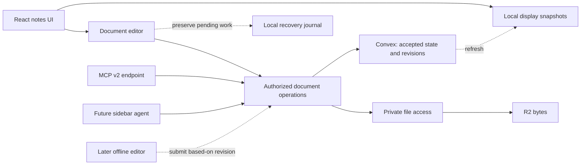

# 03 — Architecture and stack

## Chosen direction

Confirmed: prioritize immediate cached display and dependable online editing. The accepted shared document is server-authoritative. Offline editing is a later branch, not the foundation through which every online operation passes.

This is a responsibility diagram, not a requirement that browser traffic pass through an extra HTTP service. The browser can use Convex directly; MCP is an HTTP boundary over the same authorized operations.

## Proposed stack

The owner suggested React, TanStack Router, Tailwind, Better Auth, Cloudflare, and Convex. The online-first direction was accepted; exact package selections remain proposals except for the confirmed MCP v2 target and Cloudflare Email Service for password-reset delivery.

| Layer          | Candidate                                         | Decision/gate                                                                               |
| -------------- | ------------------------------------------------- | ------------------------------------------------------------------------------------------- |
| UI/build       | React + TypeScript + Vite SPA                     | Recommended; keep initial imports small                                                     |
| Routing        | TanStack Router                                   | Recommended; cached routes must not await remote auth/data                                  |
| Styling        | Tailwind                                          | Recommended; no heavy component suite mandated                                              |
| Editor         | ProseMirror, directly or through Tiptap           | G01: test existing Deltos editor reuse versus Tiptap integration                            |
| Collaboration  | `@convex-dev/prosemirror-sync` first candidate    | G02: prove required behavior and extension points                                           |
| Backend        | Convex                                            | Preferred shared authority, subscriptions, domain operations, scheduled work                |
| Local storage  | IndexedDB + Dexie                                 | Display snapshots and separate durable recovery journal; no Dexie Cloud requirement         |
| Auth           | Better Auth with supported Convex integration     | G03: compatible versions, transport, lifecycle, recovery, MCP OAuth                         |
| Email delivery | Cloudflare Email Service — Email Sending          | Confirmed provider for v1 password-reset emails; actual domain/account delivery remains G03 |
| Hosting        | Cloudflare Workers Static Assets                  | Proposed frontend delivery and narrow HTTP edge responsibilities                            |
| Object bytes   | Private Cloudflare R2                             | Proposed; one file metadata/authorization contract owned by backend                         |
| MCP            | Official TypeScript SDK v2; protocol `2026-07-28` | Confirmed; G04 checks actual target clients                                                 |
| Offline shell  | Service worker                                    | Cache essential app/editor assets; exclude auth ceremonies and credential-bearing traffic   |
| Future native  | React Native possible                             | Deferred; browser editor/Dexie do not automatically become native components                |

No new versions are pinned in this documentation task. When implementing, use the host baseline for Node/pnpm/Playwright/uv and verify library compatibility/security. Preserve required generated types; do not reuse old version pins merely because archived code compiled.

## Three kinds of local state

| State                 | Meaning                                                  | Recovery behavior                                                                                  |
| --------------------- | -------------------------------------------------------- | -------------------------------------------------------------------------------------------------- |
| Confirmed snapshots   | Last received server versions, titles, previews, content | Replaceable/rebuildable; account-scoped                                                            |
| Pending-edit journal  | Work not yet acknowledged by the server                  | Must not be evicted as ordinary cache; retain until acknowledgement or deliberate recovery/discard |
| Future offline drafts | Deliberate disconnected edits plus their base revisions  | Reconcile or create a conflict copy according to document 04                                       |

Never label journal data as a server-confirmed snapshot. Include note ID, base revision, operation/request IDs, account scope, and schema version. Avoid long debounces that make mobile process termination lose acknowledged local work. Browser storage can fail or be evicted; surface save failures and do not claim universal durability against device/browser data deletion.

## Performance boundaries

- Cache the app shell and essential editor assets; network access cannot be necessary to display cached notes.
- Confirmed Q04: cache all current note text in the accessible library; lazy-load pictures and PDFs. Populate text incrementally in the background, keeping network/CPU work off the launch and interaction paths. Persisting the library does not mean hydrating every document into memory at launch.
- Read the list from an indexed projection. Do not hydrate every note/editor to render home.
- Lazy-load advanced features, but avoid serial chunk fetches on ordinary note opening. Precache the basic editor for returning use.
- Isolate editor updates from agent chat, notifications, sidebar state, and full-library rerenders.
- Perform expensive indexing/preview work incrementally and off the interaction path; use workers when justified.
- Reserve embed space; background refresh must not replace typed content or unexpectedly reset selection.
- Establish auth/connection alongside local display. Numeric budgets and target datasets are Q10.

## Shared backend responsibilities

Convex is proposed to own accepted notes and revisions, authorization, claim leases, sharing/publication records, file metadata, idempotency results, and indexed search projections. UI and MCP call the same mutation/transform rules. Presence can be ephemeral and is not part of permanent note history. Reminders target v2; reminder scheduling/delivery is not a first-release dependency. Proposed for v2: authoritative reminder schedules also live in Convex.

Cloudflare provides frontend delivery and private byte access as needed. Do not duplicate the authoritative note store, permissions rules, or scheduler across providers. A Worker used for MCP or file access must authenticate the caller and invoke the authorized backend contract; an edge deployment is not permission to bypass it.

Cloudflare Email Service is confirmed for password-reset delivery. Proposed: the auth library owns reset-token creation/validation and password changes; the backend sends the resulting transactional message through Cloudflare. Use the REST API or a narrow Worker binding integration after compatibility testing, with sending credentials restricted to the server. Provider acceptance alone does not prove inbox delivery.

A file upload and a database transaction cannot be assumed atomic together. Use staged records and explicit finalize/retry/cleanup behavior. Search and publication projections identify the revision they represent; an acknowledged edit must remain durable even while derived work catches up.

## Technical gates

| Gate | What must be demonstrated                                                                                                                                                                                                  |
| ---- | -------------------------------------------------------------------------------------------------------------------------------------------------------------------------------------------------------------------------- |
| G01  | Natural iPhone text selection, composition, paste, embeds, shortcuts, and acceptable editor startup using the selected engine                                                                                              |
| G02  | Centralized collaborative edits; authorizing and validating affected content; claim enforcement; agent transforms; cache-to-live handoff; pending-edit recovery; bounded history/storage costs                             |
| G03  | Supported Better Auth/Convex arrangement; long-lived sessions; expired short-lived token recovery; late responses/account switches; independent agent grants; emailed password-reset flow through Cloudflare Email Service |
| G04  | MCP SDK v2 protocol/auth compatibility with actual intended clients, not just an SDK unit test                                                                                                                             |
| G05  | Representative library/document/file limits, costs, backups, and successful restore; storage limits cannot be removed from tests to make the component fit                                                                 |

If a gate fails, record the concrete limitation and compare alternatives. Do not silently restore the full local-first architecture or weaken the owner's behavior requirements.

## Technical references checked during discussion

- [Convex synchronization](https://www.convex.dev/sync): realtime subscriptions are not a complete durable offline sync engine.
- [ProseMirror sync component](https://github.com/get-convex/prosemirror-sync/blob/main/README.md): candidate supports server-side transforms; its current README lists durability/presence/size limitations. Specifically investigate the 1 MB document ceiling and failed unmount flush. Presence, lock enforcement, and robust recovery are not assumed turnkey.
- [Tiptap integration performance](https://tiptap.dev/docs/guides/performance): isolate editor rendering from unrelated React updates.
- [TanStack Router splitting](https://tanstack.com/router/latest/docs/guide/code-splitting): use splitting without introducing network-dependent cached navigation.
- [Better Auth/Convex React guide](https://labs.convex.dev/better-auth/framework-guides/react): cross-domain transport and compatible versions need deliberate verification.
- [MCP SDK v2](https://ts.sdk.modelcontextprotocol.io/v2/): SDK/protocol target is distinct from an app manifest.
- [Browser storage](https://developer.mozilla.org/en-US/docs/Web/API/Storage_API/Storage_quotas_and_eviction_criteria): offline availability requires capacity and persistence handling.

- [Cloudflare Email Service](https://developers.cloudflare.com/email-service/) and [sending setup](https://developers.cloudflare.com/email-service/get-started/send-emails/), checked 2026-09-28: outbound transactional sending supports password resets through Workers bindings, REST, or SMTP. Docs label Email Sending beta on Workers Paid; domain setup requires Cloudflare DNS and sender-domain onboarding. G03 must verify the selected account/domain and actual recipient delivery before acceptance. Provider selection does not authorize plan purchases or DNS changes.
